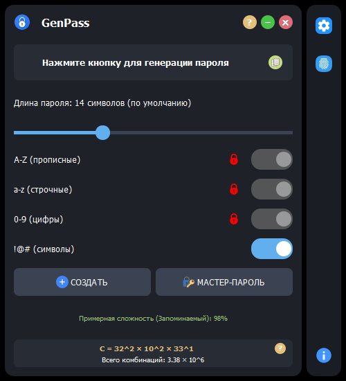

# 🔐 GenPass - Генератор надежных паролей

GenPass - это современное приложение для создания криптостойких паролей с интуитивно понятным интерфейсом. Приложение разработано с использованием PyQt5 и предлагает широкий набор функций для генерации и управления паролями.

## 🔧 Последние улучшения

### Версия 1.0.4 (Март 2025)

Полную историю изменений можно найти в [CHANGELOG.md](CHANGELOG.md).

## 📸 Скриншоты

<p align="center">
  
</p>

## ✨ Основные возможности

- 🎯 **Криптостойкая генерация паролей**
  - Настраиваемая длина пароля (от 6 до 32 символов)
  - Выбор используемых символов (прописные и строчные буквы, цифры, специальные символы)
  - Гарантированное включение всех выбранных типов символов
  - Использование криптографически стойкого модуля `secrets` для генерации
  - Четыре алгоритма генерации: стандартный, фонетический, шаблонный и запоминаемый

- 🧮 **Расширенный калькулятор комбинаций**
  - Наглядное отображение формул расчета для каждого алгоритма
  - Интерактивное диалоговое окно с подробными объяснениями
  - Математические формулы с примерами расчетов
  - Визуализация энтропии паролей и количества возможных комбинаций
  - Адаптивные формулы в зависимости от выбранных параметров пароля

- 🔒 **Улучшенный алгоритм мастер-пароля**
  - Генерация уникальных 16-символьных паролей на основе мастер-пароля и домена
  - Использование алгоритма PBKDF2 с 100,000 итераций для защиты от атак перебором
  - Детерминированная генерация (одинаковые входные данные всегда дают одинаковый пароль)
  - Гарантированное включение всех типов символов (заглавные, строчные, цифры, спецсимволы)

- 📊 **Усовершенствованный анализ надежности**
  - Точный расчет сложности пароля на основе энтропии и разнообразия символов
  - Отображение примерной сложности при настройке параметров
  - Отображение фактической сложности после генерации пароля
  - Расчет количества возможных комбинаций с наглядной формулой
  - Цветовая индикация уровня защиты (красный, желтый, зеленый)

- 🖥️ **Современный пользовательский интерфейс**
  - Анимация печати при генерации пароля
  - Анимированные элементы управления (кнопки, слайдеры, переключатели)
  - Темная тема с акцентными цветами
  - Интуитивно понятное расположение элементов
  - Контекстные подсказки и детальные объяснения для всех функций
  - Адаптивный дизайн для разных разрешений экрана

## 🔄 Алгоритмы генерации паролей

### 1. Стандартный алгоритм
Создает пароли с использованием полностью случайного набора символов из выбранных категорий. Обеспечивает максимальную криптостойкость, но такие пароли могут быть сложны для запоминания.

### 2. Фонетический алгоритм
Генерирует пароли, чередуя согласные и гласные буквы, что делает их более произносимыми и легкими для запоминания. При этом сохраняется достаточно высокий уровень защиты, особенно при добавлении цифр и специальных символов.

### 3. Шаблонный алгоритм
Создает пароли по заданному шаблону, гарантируя равномерное распределение различных типов символов. Например, для пароля длиной 8 символов будет использовано по 2 символа каждого типа: 2 заглавные буквы, 2 строчные, 2 цифры и 2 специальных символа.

### 4. Запоминаемый алгоритм
Формирует пароли на основе двух случайных слов из словаря с добавлением цифр и специальных символов. Такие пароли легко запомнить и воспроизвести, сохраняя при этом достаточный уровень защиты для большинства сценариев использования.

## 🛠 Технологии

- **Python** - основной язык программирования
- **PyQt5** - фреймворк для создания графического интерфейса
- **Secrets** - криптографически стойкий генератор случайных чисел
- **PBKDF2** - алгоритм формирования ключа для генерации паролей по мастер-паролю
- **PyInstaller** - для создания исполняемых файлов
- **Многоалгоритмический подход** - реализация четырех различных алгоритмов генерации паролей
- **Математические модели** - формулы расчета энтропии и комбинаций для оценки криптостойкости

## 🔢 Формулы расчета комбинаций

В приложении используются следующие формулы для расчета возможных комбинаций:

- **Стандартный алгоритм**: C = N^L, где N - размер алфавита, L - длина пароля
- **Фонетический алгоритм**: C = (21^(L/2)) × (5^(L/2)) × k, где 21 - количество согласных, 5 - количество гласных, k - коэффициент для цифр и спецсимволов
- **Шаблонный алгоритм**: C = (26^Lu) × (26^Ll) × (10^D) × (33^S), где Lu, Ll, D, S - количество букв верхнего регистра, нижнего регистра, цифр и спецсимволов
- **Запоминаемый алгоритм**: C = W^2 × 10^Nd × 33^Ns, где W - размер словаря, Nd - количество цифр, Ns - количество спецсимволов

Детальное объяснение каждой формулы с примерами доступно в интерактивном диалоговом окне приложения.

## 🎨 Интерфейс и диалоговые окна

### Основной интерфейс
- **Современный дизайн** с темной темой и акцентными цветами
- **Интуитивное расположение элементов управления** для удобства использования
- **Адаптивные переключатели** изменяют свою доступность в зависимости от выбранного алгоритма
- **Визуальный индикатор силы пароля** с цветовой кодировкой и контекстными подсказками

### Диалоговое окно "Формула расчета комбинаций"
- **Поддержка перетаскивания** для удобного позиционирования окна
- **Градиентный фон** для улучшенного визуального восприятия
- **Подробное текстовое объяснение формул** для каждого алгоритма
- **Примеры расчетов** с конкретными значениями для наглядности
- **Математическая нотация** для больших чисел в стиле "1.1 × 10^7"
- **Контекстное содержимое** в зависимости от выбранного алгоритма генерации

### Калькулятор комбинаций
- **Динамическое обновление формул** при изменении параметров
- **Наглядное отображение** количества возможных комбинаций
- **Интеграция с основным интерфейсом** для быстрого доступа
- **Кнопка помощи** для вызова подробного диалогового окна с объяснениями

## 🚀 Установка и запуск

### Вариант 1: Готовые сборки для Windows

Для пользователей Windows 10/11 доступны готовые портативные сборки приложения:

1. Перейдите в раздел [Releases](https://github.com/MaksymLeiber/genpass/releases) на GitHub
2. Скачайте подходящую версию:
   - `GenPass-x64.exe` для 64-битных систем (рекомендуется)
   - `GenPass-x86.exe` для 32-битных систем
3. Просто запустите скачанный файл - установка не требуется
4. Приложение готово к использованию сразу после запуска

### Вариант 2: Запуск из исходного кода

```bash
# Клонирование репозитория
git clone https://github.com/MaksymLeiber/genpass.git
cd genpass

# Установка зависимостей
pip install -r requirements.txt

# Запуск приложения
python run.py
```

## 📝 Лицензия

MIT License - подробности в файле [LICENSE](LICENSE)

## 👨‍💻 Разработчик

Макс Лейбер
- GitHub: [MaksymLeiber](https://github.com/MaksymLeiber)

## 🤝 Вклад в проект

Если вы хотите внести свой вклад в проект:
1. Сделайте форк репозитория
2. Создайте ветку для своих изменений
3. Внесите изменения
4. Создайте Pull Request

## 📞 Обратная связь

Если у вас есть вопросы или предложения, пожалуйста, создайте Issue в этом репозитории. 