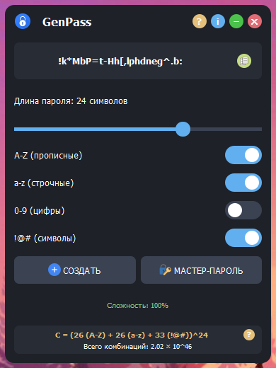
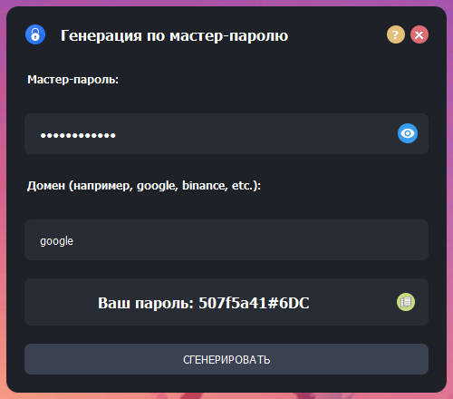

# 🔐 GenPass - Генератор надежных паролей

GenPass - это современное приложение для создания криптостойких паролей с интуитивно понятным интерфейсом. Приложение разработано с использованием PyQt5 и предлагает широкий набор функций для генерации и управления паролями.

## 📸 Скриншоты

  
  

## ✨ Основные возможности

- 🎯 **Генерация паролей различной сложности**
  - Настраиваемая длина пароля
  - Выбор используемых символов (прописные и строчные буквы, цифры, специальные символы)
  - Расчет криптостойкости в реальном времени

- 🔒 **Мастер-пароль**
  - Генерация уникальных паролей на основе мастер-пароля и домена
  - Повторяемость результатов (одинаковые входные данные всегда дают одинаковый пароль)
  - Безопасное хранение (все вычисления происходят локально)
  - Подробная справка по использованию

- 📊 **Анализ надежности**
  - Визуальный индикатор сложности
  - Расчет количества возможных комбинаций
  - Наглядное представление формулы расчета
  - Цветовая индикация уровня защиты

## 🛠 Технологии

- **Python** - основной язык программирования
- **PyQt5** - фреймворк для создания графического интерфейса
- **PyInstaller** - для создания исполняемых файлов
- **Hashlib** - для генерации паролей на основе мастер-пароля

## 🎨 Особенности дизайна

- Современный темный интерфейс
- Анимированные элементы управления (кнопки, слайдеры, переключатели)
- Цветовая индикация уровня защиты (красный, желтый, зеленый)
- Интуитивно понятное расположение элементов
- И многое другое... 

## 📝 Лицензия

MIT License - подробности в файле [LICENSE](LICENSE)

## 👨‍💻 Разработчик

Макс Лейбер
- GitHub: [MaksymLeiber](https://github.com/MaksymLeiber)

## 🤝 Вклад в проект

Если вы хотите внести свой вклад в проект:
1. Сделайте форк репозитория
2. Создайте ветку для своих изменений
3. Внесите изменения
4. Создайте Pull Request

## 📞 Обратная связь

Если у вас есть вопросы или предложения, пожалуйста, создайте Issue в этом репозитории. 